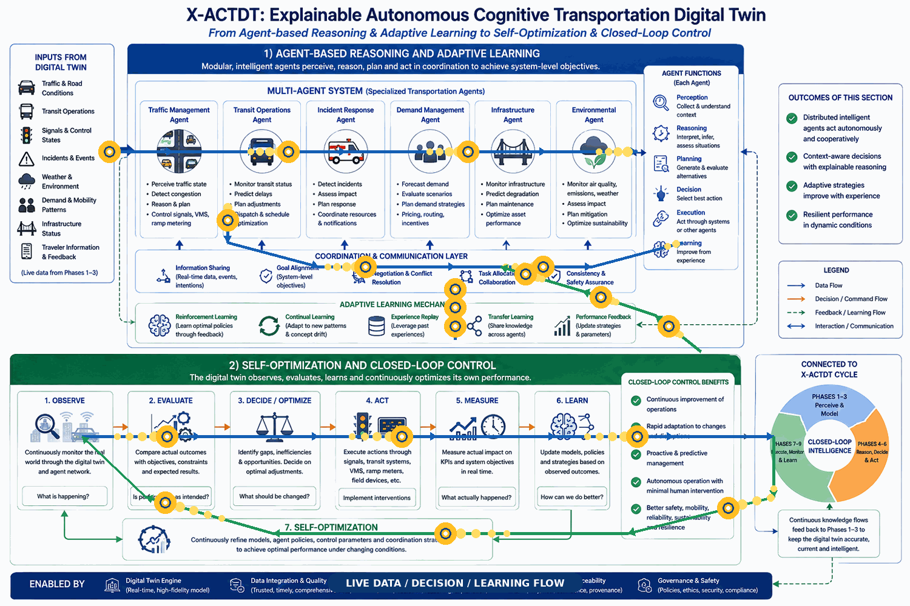

<div align="center">

# 🚦 X-ACTDT
## An E**x**plainable **A**utonomous **C**ognitive **T**ransportation **D**igital **T**win 

</div>

E**X**plainable **A**utonomous **C**ognitive **T**ransportation **D**igital **T**win (**X-ACTDT**) is an advanced framework for next-generation transportation digital twins that bridges the gap between static simulation and adaptive, real-time urban management. By seamlessly integrating state-of-the-art machine learning paradigms, the system delivers secure, self-updating, and audit-ready intelligence for complex transportation networks.

## 🚀 Core Technical Pillars

* **[X] Explainability via MLLMs:** Utilizing explainable multimodal large language models (MLLMs) for transparent cross-modal synthesis and audit-ready intelligence.
* **[A] Autonomous Control:** Empowering self-governing agents to manage dynamic traffic environments without constant human intervention.
* **[C] Cognitive Intelligence:** Powered by a comprehensive cognitive suite—integrating **Reinforcement Learning** for optimal policy control and decision-making, **Continual Learning** to prevent catastrophic forgetting in non-stationary environments, and **Meta-Learning** for dynamic meta-feature extraction and model routing.
* **[T] Transportation Domain:** Designed specifically for complex, large-scale urban traffic and mobility networks.
* **[DT] Digital Twin Architecture:** Operating at **Level Autonomy**—evolving far beyond passive visualization or simulation into an active, self-optimizing closed-loop twin that dynamically enacts intelligent control policies on physical transportation systems.

## 🎯 Digital Twins vs World Models

While sometimes are misused interchangeably they are different concepts, Digital Twins and World Models are fundamentally distinct paradigms governed by different architectural criteria.

### 1. Digital Twin Criteria

A system qualifies as a **Digital Twin** if it meets all of the following conditions:

* **(i) Specific Representation:** It represents a specific physical entity rather than a generic class.
* **(ii) Persistent Connection:** It maintains a bidirectional, persistent data connection to that physical counterpart.
* **(iii) Lifecycle Coupling:** It is dynamically coupled to the entity's lifecycle.

> *Note:* Without a physical counterpart, a digital twin cannot exist.

### 2. World Model Criteria

A system qualifies as a **World Model** if it meets the following criteria:

* **(i) Learned Dynamics:** It learns a state transition function from data itself, expressed as $x_{t+1} = f(x_t, a_t)$, capturing how an environment evolves in response to actions.
* **(ii) Predictive Planning:** It supports prediction and planning through imagined future states.
* **(iii) Abstract Representations:** It operates on learned representations rather than relying exclusively on hand-crafted physics.

> *Note:* A physical referent is entirely optional.

---

### Summary Comparison

| Dimension | Digital Twin | World Model |
| --- | --- | --- |
| **Physical Referent** | Mandatory (A specific entity) | Optional |
| **Data Connection** | Bidirectional and persistent | None required (operates on learned data/representations) |
| **Core Function** | Lifecycle tracking and synchronization | State transition learning ($$x_{t+1} = f(x_t, a_t)$$) and imagined planning |

---

## 📚 Core Architecture


A cutting-edge architecture for next-generation transportation digital twins, integrating **Reinforcement Learning (RL)**, **Continual Learning (CL)**, **Meta-Learning**, and **Explainable Multimodal Large Language Models (MLLMs)**.

<p align="center">
  
</p>

### Phases 1–3: From Real-World Data to a Live Digital Twin

The first three phases establish the foundation of the Explainable Autonomous Cognitive Transportation Digital Twin (X-ACTDT) by transforming observations of the physical transportation environment into a continuously updated virtual representation.

* Phase 1 — Data Collection gathers heterogeneous observations from road networks, traffic sensors, signals, transit systems, vehicles, incidents, weather, mobility demand, infrastructure, events, and environmental sources while preserving their spatial, temporal, quality, and provenance information.
* Phase 2 — Data Ingestion and Integration validates, standardizes, synchronizes, georeferences, harmonizes, and fuses these heterogeneous observations into a consistent and trustworthy data environment. 
* Phase 3 — Digital Twin Engine uses the integrated information to maintain a live, dynamic, spatiotemporal model of the transportation system, representing roads, traffic, transit, signals, incidents, demand, weather, infrastructure, and environmental conditions. 

Together, Phases 1–3 transform raw observations into a synchronized and traceable digital representation of reality that provides the trusted foundation for cognitive reasoning, prediction, and autonomous decision-making.

### Phases 4–6: From Understanding to Decision and Action

The next three phases transform the live digital twin into an intelligent decision-making and intervention system. 

* Phase 4 — Cognitive AI interprets the current transportation state by combining information from multiple sources, performing spatial-temporal reasoning, detecting anomalies and incidents, forecasting traffic and travel demand, exploring alternative scenarios, and generating explainable insights with associated confidence levels. 
* Phase 5 — Decision evaluates possible responses against operational objectives, safety requirements, policies, constraints, resources, and predicted outcomes, selecting the most appropriate action while maintaining a traceable explanation of why that decision was chosen. 
* Phase 6 — Action/Intervention converts the selected decision into executable operational commands, validates them for safety and feasibility, and dispatches them to real-world transportation systems such as traffic signals, variable message signs, transit operations, routing systems, infrastructure controls, and traveler-information platforms. 

Together, Phases 4–6 transform the digital twin from a representation of the transportation system into an explainable autonomous intelligence capable of understanding situations, selecting appropriate interventions, and initiating real-world action.

### Phases 7–9: From Real-World Execution to Continuous Learning

The final three phases close the autonomous learning loop by determining what actually happened after an intervention and using the results to improve future operations. 

* Phase 7 — Real-World Execution deploys the selected intervention through transportation agencies, traffic-control systems, transit operators, infrastructure systems, connected vehicles, and traveler-information services, while recording what was actually implemented and when. 
* Phase 8 — Monitor and Measure continuously observes the transportation environment after the intervention and evaluates its effects using mobility, safety, reliability, sustainability, equity, and user-experience indicators, comparing actual outcomes against objectives, baselines, and expected results. 
* Phase 9 — Feedback and Learning analyzes these results to identify successes, shortcomings, causal factors, new patterns, and uncertainties, then updates AI models, digital-twin parameters, knowledge bases, decision policies, and intervention strategies. 

The resulting knowledge is fed back into the earlier phases, creating a closed-loop AC-TDT that continuously observes, understands, decides, acts, measures, learns, and improves while maintaining traceability and explainability throughout the entire operational cycle.

---

# 📌 Key Considerations

---

## 📖 Beyond Black Boxes

The Explainable Necessity in Autonomous Transportation:

**Explainable Autonomous Cognitive Transportation Digital Twins (X-ACTDT)** is a next-generation framework designed to transition urban management from static simulation to adaptive and cognitive control. The architecture achieves secure, audit-ready intelligence through:
* **Optimal Policy Control:** Powered by reinforcement learning.
* **Non-Stationary Adaptation:** Using continual learning to eliminate catastrophic forgetting.
* **Dynamic Model Routing:** Leveraging meta-learning for advanced meta-feature extraction.
* **Transparent Synthesis:** Utilizing explainable multimodal large language models (MLLMs) for cross-modal reasoning.


A live demonstration of our Explainable Autonomous Cognitive Transportation Digital Twin, highlighting how cognitive modeling and real-time visualization empower safer, more transparent AI-driven traffic systems.

<p align="center">
  
</p>

## 🏗️ Multimodal Selection

Selecting an optimal multimodal foundation model remains a fundamental challenge in transportation digital twins. Traditionally, a single architecture struggled to excel simultaneously across text, time series, video streams, and graph topologies because each modality demands distinct mathematical formalisms—such as sequential semantics for text, temporal dependencies for time series, spatial representations for video, and relational structures for transit networks. 

However, modern foundation models increasingly overcome these boundaries by projecting diverse modalities into a unified embedding space, mitigating the performance compromises once inherent in rigid, siloed frameworks.

<p align="center">
  
</p>

As shown in the figure above—which provides a general example rather than a complete set of options—choosing an architecture has historically depended on human expertise to tailor models to specific tasks. While manual designs provide strong general-purpose baselines, they might be not sufficient when apply to specialized or domain specific modalities. Thus, rather than depending on rigid, single-instance selections when conventional designs prove insufficient, it is crucial to iteratively update and optimize these models. Automated approaches such as neural architecture search or network growth techniques can be used to extend or improve the existing solutions (learn more at [greenmoo](https://github.com/phamdps/greenmoo)).

## 🌐 Exploring Typical Architectures

Evaluating existing multimodal models requires careful consideration of their **explainability and interpretability**. A prime example of such a model applied to a digital twin is Qwen2-VL, with its architecture detailed below:

<p align="center">
  
</p>

Examining the architecture of each multimodal model is essential to understanding its internal mechanics and how it generates system reasoning, ensuring transparency in all decision-making processes. For further details on multimodal explainability, visit [explainable-fm](https://github.com/phamdps/explainable-fm). To dive deeper into the operational mechanics of Multimodal Large Language Models (MLLMs), check out [MLLMs](https://github.com/phamdps/MLLMs).

## 🧠 Enabling Autonomous Decision and Planning

While cognitive capabilities enable a digital twin to understand intentions and perceive the system state, autonomous management further requires the capacity to make decisions, plan actions, and adapt to changing conditions without explicit human intervention. This section discusses how agent-based reasoning and adaptive learning provide the mechanism for decision-making, and how self-optimization and closed-loop control complete the cycle of autonomous management.

* Agent-based Reasoning and Adaptive Learning: Agent-based reasoning allows the digital twin with a modular structure capable of acting intelligently in complex environments. Each agent embodies autonomy, perception, reasoning, and learning, functioning as both a decision-maker and an executor of management tasks. Within a digital twin system, agents perceive environmental inputs, analyze contextual information, generate management plans, and execute actions through interactions with the underlying physical or simulated systems. Reinforcement and continual learning further allow these agents to refine strategies from experience and coordinate with others in multi-agent settings.

<p align="center">
  
</p>

* Self-Optimization and Closed-Loop Control: Self-optimization is the culmination of autonomous management, where digital twins no longer rely on external commands but continuously refine their performance through closed-loop feedback. The system observes its own behavior, identifies inefficiencies, and implements corrective actions automatically. When combined with predictive and cognitive capabilities, closed-loop control transforms the twin into an autonomous entity capable of sustaining optimal performance with minimal supervision.

Further information for this step will be clarified in the [ai-assistant](https://github.com/phamdps/ai-assistant) repository.

---

# 📌 Project Architecture & Structure

```text
cognitive_transdt/
├── configs/                       # Hyperparameters and system configurations
│   ├── rl_config.yaml             # RL agent and environment parameters
│   ├── cl_config.yaml             # Continual learning memory & rehearsal settings
│   ├── meta_config.yaml           # Meta-feature extractor & model routing rules
│   └── mllm_config.yaml           # Multimodal large model & explanation hooks
├── data/                          # Data pipelines and metadata storage
│   ├── raw/                       # Raw feeds (CCTV video, LiDAR point clouds, loop detectors)
│   ├── processed/                 # Synchronized and aligned telemetry
│   └── meta_features/             # Extracted meta-features for model routing
├── models/                        # Core algorithmic implementations
│   ├── reinforcement_learning/    # RL policies for dynamic control & safe-to-fail simulation
│   ├── continual_learning/        # Memory buffers and regularization against catastrophic forgetting
│   ├── meta_learning/             # Few-shot adaptation and dynamic model selection
│   └── mllms/                     # Multimodal integration and explainability (XAI) layers
├── environment/                   # Digital twin simulation sandbox
│   ├── simulator_interface.py     # Bridges physical feeds with virtual simulation (SUMO/CityFlow)
│   └── state_observer.py          # Real-time state synchronization
├── evaluation/                    # Testing, verification, and audit metrics
│   ├── safety_metrics.py          # Stress-testing against extreme disruption scenarios
│   └── explainability_eval.py     # Validating operator trust and interpretability
├── scripts/                       # Execution entry points
│   ├── train_rl.py
│   ├── update_cl.py
│   ├── meta_route.py
│   └── run_digital_twin.py
└── README.md
```

---

## 🚀 Core Technical Components

### 1. Reinforcement Learning (RL) for Dynamic Control
*   **Optimal Policy Testing:** Solves complex multi-objective problems such as adaptive traffic signal control and dynamic congestion pricing inside the digital twin sandbox.
*   **Safe-to-Fail Experimentation:** Stress-tests extreme disruption scenarios (accidents, severe weather) virtually before deploying interventions to live infrastructure.

### 2. Continual Learning (CL) for Evolving Environments
*   **Preventing Catastrophic Forgetting:** Incremental updates allow the system to absorb new urban layouts, construction zones, and seasonal traffic flows without erasing historical knowledge.
*   **Edge-Cloud Synchronization:** Distributes lightweight continual learning updates across edge nodes for zero-downtime adaptation.

### 3. Meta-Learning for Modality Adaptation & Model Selection
*   **Meta-Feature Extraction:** Evaluates statistical and structural properties of incoming data streams (e.g., spatial sparsity of LiDAR vs. temporal density of loop detectors).
*   **Dynamic Routing & Few-Shot Adaptation:** Instantly selects, combines, or fine-tunes the optimal multimodal model configuration for unprecedented or sudden operational states.

### 4. Explainable Multimodal Large Language Models (MLLMs)
*   **Cross-Modal Synthesis:** Fuses CCTV, LiDAR, and emergency dispatch logs into a unified semantic understanding of traffic events.
*   **Operator Transparency:** Provides human-interpretable rationales for automated routing and signal overrides, ensuring regulatory compliance and high-stakes accountability.

---

## 📚 Related Literature (2025–2026)

1. **Digital Twin AI Lifecycles and Frameworks**
   * Research collaboration on Digital Twin AI. (2026). *Digital Twin AI: Opportunities and Challenges from Large Language Models*. arXiv. https://arxiv.org/html/2601.01321v1

2. **Transport Planning Digital Twins Review**
   * Nag, D., et al. (2025). Exploring digital twins for transport planning: a review. *European Transport Research Review*, 17(15). https://doi.org/10.1186/s12544-025-00713-0

3. **Intelligent Transport Systems Resilience & Digital Twins**
   * Machkour, B. (2025). Digital Twins in Intelligent Transport Systems: A Systematic Review. *Digital*, 9(8), 123. https://www.mdpi.com/2624-6511/9/8/123

4. **In-Context Learning and Updating Digital Twins**
   * Conference on Machine Learning (ICML) Proceedings. (2025). *Continuously Updating Digital Twins using Large Language Models (CALM-DT)*. ICML Virtual Poster Session. https://icml.cc/virtual/2025/poster/44291

5. **Hybrid Meta-Learning and Reinforcement Learning Frameworks**
   * Harshinni, B. (2025/2026). Hybrid Digital Twin Framework with Meta-Learning and Reinforcement Learning. *Advances in Production*. https://proceedings.aijr.org/index.php/ap/article/view/4/4

6. **Cognitive Digital Twins and MLLM Integration**
   * Wu, S., Xu, X., Wang, C., Wu, D., & Zhu, H. (2026). Towards Large Language Model–Enabled Cognitive Digital Twins for Urban Mobility Systems. *Conference on Computer...* https://ieeexplore.ieee.org/abstract/document/11582620

7. **Advanced Modeling and Trends in Digital Twins**
   * Yang, L., Luo, S., & Yu, L. (2025). Leveraging Large Language Models for Enhanced Digital Twin Modeling: Trends, Methods, and Challenges. *arXiv preprint arXiv:2503.xxxxx*. https://www.semanticscholar.org/paper/Leveraging-Large-Language-Models-for-Enhanced-Twin-Yang-Luo/b1f636a6ecc341c3f77060373f044feef50fe726


## 📚 Additional References

### 2026
1. **Ali, A., Ali, R., Asad, M., Yang, L., Alsarhan, T., & Bai, X.** (2026). Exploiting attention-driven weather-aware multimodal spatio-temporal fusion for urban traffic flow prediction. *Future Generation Computer Systems*, 183(C).
2. **Fang, Y., Miao, H., Liang, Y., Deng, L., Cui, Y., Zeng, X., Xia, Y., Zhao, Y., Pedersen, T. B., Jensen, C. S., Zhou, X., & Zheng, K.** (2026). Unraveling Spatio-Temporal Foundation Models via the Pipeline Lens: A Comprehensive Review. *IEEE Transactions on Knowledge and Data Engineering*, 38(3), 2040–2063.
3. **Hassija, V., Majumder, T., Roy, D., Piyush, R., & Chamola, V.** (2026). The role of large language models (LLMs) in enhancing intelligent transportation systems: A survey. *Vehicular Communications*, 58(C).
4. **Kaur, S., Sehra, S. S., Ebrahimi, D., Wang, X., Singh, J., & Sehra, S. K.** (2026). Harnessing Large Language Models for Intelligent Transportation Systems: A Systematic Review. *Multimodal Transportation*, 5(3), 100308.
5. **Long, Q., Liu, S., Cao, N., Ren, Z., Luo, X., Ju, W., Fang, C., Zhu, Z., Zhu, H., & Zhou, Y.** (2026). A Survey of Large Language Models for Traffic Forecasting: Methods and Applications. *IEEE Transactions on Big Data*, 12, 1083–1101.
6. **Tu, W., Li, J., Xiao, F., Wang, X., & Lu, Y.** (2026). Integrating Large Language Models into Traffic Systems: Integration Levels, Capability Boundaries, and an Information-Theoretic Perspective. *Entropy*, 28(2).

### 2025
7. **Cao, Y., Zhao, H., Cheng, Y., Shu, T., Chen, Y., Liu, G., Liang, G., Zhao, J., Yan, J., & Li, Y.** (2025). Survey on Large Language Model-Enhanced Reinforcement Learning: Concept, Taxonomy, and Methods. *IEEE Transactions on Neural Networks and Learning Systems*, 36(6), 9737–9757.
8. **Fang, B., Yang, Z., & Di, X.** (2025). TraveLLM: Could You Plan My Public Transit Alternatives in Face of a Network Disruption? *2025 IEEE 28th International Conference on Intelligent Transportation Systems (ITSC)*, 4711–4717.
9. **Hu, B., Zhang, K., Zhang, Y., & Ye, Y.** (2025). Adaptive multimodal fusion: dynamic attention allocation for intent recognition. *Proceedings of the Thirty-Ninth AAAI Conference on Artificial Intelligence (AAAI'25)*.
10. **Hu, C., Niu, R., Lin, Y., Yang, B., Chen, H., Zhao, B., & Zhang, X.** (2025). Probabilistic Trajectory Prediction of Vulnerable Road User Using Multimodal Inputs. *IEEE Transactions on Intelligent Transportation Systems*, 26(2), 2679–2689.
11. **Jiang, J., Li, Y., Nie, J., Li, J., Wen, B., & Gadekallu, T. R.** (2025). Integrating large language models with cross-modal data fusion for advanced intelligent transportation systems in sustainable cities development. *Applied Soft Computing*, 177, 113278.
12. **Mahmud, D., Hajmohamed, H., Almentheri, S., Alqaydi, S., Aldhaheri, L., Khalil, R. A., & Saeed, N.** (2025). Integrating LLMs With ITS: Recent Advances, Potentials, Challenges, and Future Directions. *IEEE Transactions on Intelligent Transportation Systems*, 26(5), 5674–5709.
13. **Maksoud, N., AlJassmi, H., Ali, L., & Masoud, A. R.** (2025). Applications of large language models and generative AI in transportation: A systematic review and bibliometric analysis. *Transportation Research Interdisciplinary Perspectives*, 34, 101699.
14. **Nie, T., Sun, J., & Ma, W.** (2025). Exploring the roles of large language models in reshaping transportation systems: A survey, framework, and roadmap. *Artificial Intelligence for Transportation*, 1, 100003.
15. **Peng, M., Guo, X., Chen, X., Chen, K., Zhu, M., Chen, L., & Wang, F.-Y.** (2025). LC-LLM: Explainable lane-change intention and trajectory predictions with Large Language Models. *Communications in Transportation Research*, 5, 100170.
16. **Yan, Y., Cui, S., Liu, J., Zhao, Y., Zhou, B., & Kuo, Y.-H.** (2025). Multimodal fusion for large-scale traffic prediction with heterogeneous retentive networks. *Information Fusion*, 114.
17. **Yang, L., Luo, S., Cheng, X., & Yu, L.** (2025). Leveraging Large Language Models for Enhanced Digital Twin Modeling: Trends, Methods, and Challenges. *arXiv preprint arXiv:2503.02167*.
18. **Zou, X., Yan, Y., Hao, X., Hu, Y., Wen, H., Liu, E., Zhang, J., Li, Y., Li, T., Zheng, Y., & Liang, Y.** (2025). Deep learning for cross-domain data fusion in urban computing: Taxonomy, advances, and outlook. *Information Fusion*, 113, 102606.

### 2024
19. **Guo, X., Zhang, Q., Jiang, J., Peng, M., Zhu, M., & Yang, H. F.** (2024). Towards explainable traffic flow prediction with large language models. *Communications in Transportation Research*, 4, 100150.
20. **Han, X., Zhang, Z., Wu, Y., Zhang, X., & Wu, Z.** (2024). Event Traffic Forecasting with Sparse Multimodal Data. *Proceedings of the 32nd ACM International Conference on Multimedia (MM '24)*, 8855–8864.
21. **Le, D., Yunusoglu, A., Tiwari, K., Isik, M., & Dikmen, I. C.** (2024). Multimodal LLM for Intelligent Transportation Systems. *arXiv preprint arXiv:2412.11683*.
22. **Liu, C., Yang, S., Xu, Q., Li, Z., Long, C., Li, Z., & Zhao, R.** (2024). Spatial-Temporal Large Language Model for Traffic Prediction. *2024 25th IEEE International Conference on Mobile Data Management (MDM)*, 31–40.
23. **Xia, Y., Dittler, D., Jazdi, N., Chen, H., & Weyrich, M.** (2024). LLM experiments with simulation: Large Language Model Multi-Agent System for Simulation Model Parametrization in Digital Twins. *2024 IEEE 29th International Conference on Emerging Technologies and Factory Automation (ETFA)*, 1–4.
24. **Xu, D., Peng, H., Tang, Y., & Guo, H.** (2024). Hierarchical spatio-temporal graph convolutional neural networks for traffic data imputation. *Information Fusion*, 106.
25. **Yang, H., Wu, R., & Xu, W.** (2024). TransCompressor: LLM-Powered Multimodal Data Compression for Smart Transportation. *Proceedings of the 30th Annual International Conference on Mobile Computing and Networking (ACM MobiCom '24)*, 2335–2340.
26. **Zhang, S., Fu, D., Liang, W., Zhang, Z., Yu, B., Cai, P., & Yao, B.** (2024). TrafficGPT: Viewing, processing and interacting with traffic foundation models. *Transport Policy*, 150, 95–105.
27. **Zhang, Z., Sun, Y., Wang, Z., Nie, Y., Ma, X., Li, R., Sun, P., & Ban, X.** (2024). Large Language Models for Mobility Analysis in Transportation Systems: A Survey on Forecasting Tasks. *Transportation Research Record*, 2680, 756–774.
28. **Zhong, H., Wang, J., Chen, C., Wang, J., Li, D., & Guo, K.** (2024). Weather Interaction-Aware Spatio-Temporal Attention Networks for Urban Traffic Flow Prediction. *Buildings*, 14(2), 647.
29. **Zhou, B., Liu, J., Cui, S., & Zhao, Y.** (2024). A Large-Scale Spatio-Temporal Multimodal Fusion Framework for Traffic Prediction. *Big Data Mining and Analytics*, 7(3), 621–636.

### 2023
30. **Schick, T., Dwivedi-Yu, J., Dessì, R., Raileanu, R., Lomeli, M., Zettlemoyer, L., Cancedda, N., & Scialom, T.** (2023). Toolformer: Language models can teach themselves to use tools. *Advances in Neural Information Processing Systems (NeurIPS)*, 36.
31. **Wang, X., Zhu, Z., Huang, G., Chen, X., & Jia, J.** (2023). DriveDreamer: Towards Real-World Drive Scene Synthesis via World Models. *arXiv preprint arXiv:2309.09777*.
32. **Wang, Z., Zhao, Y., Cheng, X., Huang, H., Liu, J., Tang, L., ... & Zhao, Z.** (2023). Connecting multi-modal contrastive representations. *Advances in Neural Information Processing Systems (NeurIPS)*, 37.
33. **Wen, S., et al.** (2023). Panacea: Panoramic and Controllable Video Generation for Autonomous Driving. *arXiv preprint arXiv:2311.16813*.
34. **Zhang, W., Yao, R., Du, X., Liu, Y., Wang, R., & Wang, L.** (2023). Traffic flow prediction under multiple adverse weather based on self-attention mechanism and deep learning models. *Physica A: Statistical Mechanics and its Applications*, 625, 128988.

### 2022
35. **Kojima, T., Gu, S. S., Reid, M., Matsuo, Y., & Iwasawa, Y.** (2022). Large language models are zero-shot reasoners. *Advances in Neural Information Processing Systems (NeurIPS)*, 35, 22199–22213.
36. **Mo, X., Huang, Z., Xing, Y., & Lv, C.** (2022). Multi-Agent Trajectory Prediction With Heterogeneous Edge-Enhanced Graph Attention Network. *IEEE Transactions on Intelligent Transportation Systems*, 23(7), 9554–9567.
37. **Ouyang, L., Wu, J., Jiang, X., Almeida, D., Wainwright, C., Mishkin, P., ... & Ray, A.** (2022). Training language models to follow instructions with human feedback. *Advances in Neural Information Processing Systems (NeurIPS)*, 35, 27730–27744.
38. **Wei, J., Tay, Y., Bommasani, R., Chowdhery, A., Dai, Q. V., Zou, X., ... & Zhou, D.** (2022). Emergent abilities of large language models. *Transactions on Machine Learning Research*.
39. **Wei, J., Wang, X., Schuurmans, D., Bosma, M., Xia, F., Chi, E., Le, Q. V., & Zhou, D.** (2022). Chain-of-thought prompting elicits reasoning in large language models. *Advances in Neural Information Processing Systems (NeurIPS)*, 35, 24824–24837.

### 2020
40. **Brown, T., Mann, B., Ryder, N., Subbiah, M., Kaplan, J. D., Dhariwal, P., ... & Amodei, D.** (2020). Language models are few-shot learners. *Advances in Neural Information Processing Systems (NeurIPS)*, 33, 1877–1901.
41. **Ryu, S., Kim, D., & Kim, J.** (2020). Weather-Aware Long-Range Traffic Forecast Using Multi-Module Deep Neural Network. *Applied Sciences*, 10(6), 1938.

### 2019
42. **Guo, S., Lin, Y., Feng, N., Song, C., & Wan, H.** (2019). Attention based spatial-temporal graph convolutional networks for traffic flow forecasting. *Proceedings of the 33rd AAAI Conference on Artificial Intelligence (AAAI'19)*.
43. **Zheng, P., Lin, T.-Y., Chen, C.-H., & Khoo, L. P.** (2019). Applications of digital twin technology in industrial product development: a review. *The International Journal of Advanced Manufacturing Technology*, 105(1), 2621–2637.

### 2018
44. **Tao, F., Sui, F., Liu, A., Qi, Q., Zhang, M., Song, B., Guo, Z., Lu, S. S., & Nee, A. Y.** (2018). Digital twin-driven product design, manufacturing and service with big data. *The International Journal of Advanced Manufacturing Technology*, 94(9), 3563–3576.

### 2017
45. **Christiano, P. F., Leike, J., Brown, T., Martic, M., Legg, S., & Amodei, D.** (2017). Deep reinforcement learning from human preferences. *Advances in Neural Information Processing Systems (NeurIPS)*, 30.

### 2014
46. **Grieves, M., & Vickers, J.** (2014). Digital twin: manufacturing excellence through virtual factory replication. *Forming the Future*, Springer, 85–100.