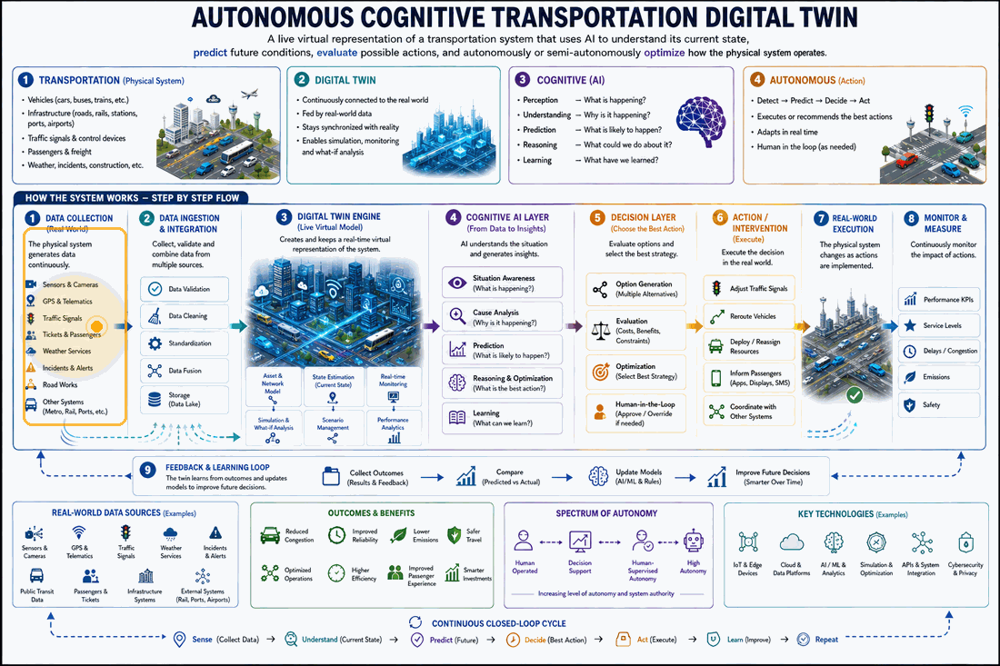
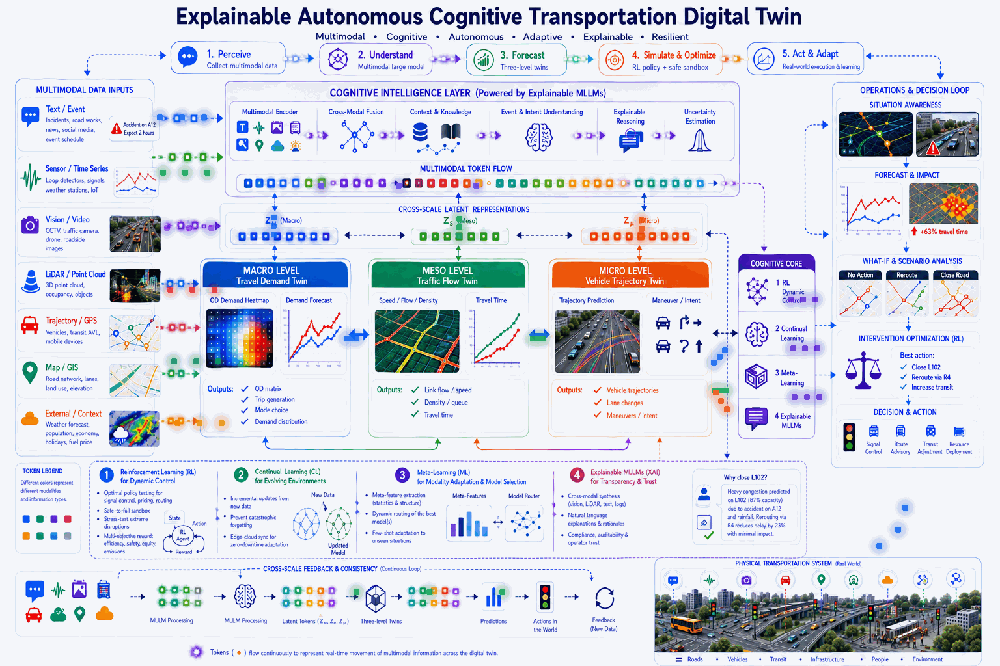

<div align="center">

# 🚦 X-ACTDT
## An E**x**plainable **A**utonomous **C**ognitive **T**ransportation **D**igital **T**win 

</div>

E**X**plainable **A**utonomous **C**ognitive **T**ransportation **D**igital **T**win (**X-ACTDT**) is an advanced framework for next-generation transportation digital twins that bridges the gap between static simulation and adaptive, real-time urban management. By seamlessly integrating state-of-the-art machine learning paradigms, the system delivers secure, self-updating, and audit-ready intelligence for complex transportation networks.

## 🚀 Core Technical Pillars

* **[X] Explainability via MLLMs:** Utilizing explainable multimodal large language models (MLLMs) for transparent cross-modal synthesis and audit-ready intelligence.
* **[A] Autonomous Control:** Empowering self-governing agents to manage dynamic traffic environments without constant human intervention.
* **[C] Cognitive Intelligence:** Powered by a comprehensive cognitive suite—integrating **Reinforcement Learning** for optimal policy control and decision-making, **Continual Learning** to prevent catastrophic forgetting in non-stationary environments, and **Meta-Learning** for dynamic meta-feature extraction and model routing.
* **[T] Transportation Domain:** Designed specifically for complex, large-scale urban traffic and mobility networks.
* **[DT] Digital Twin Architecture:** Operating at **Level Autonomy**—evolving far beyond passive visualization or simulation into an active, self-optimizing closed-loop twin that dynamically enacts intelligent control policies on physical transportation systems.

---

## 📚 Core Architecture


A cutting-edge architecture for next-generation transportation digital twins, integrating **Reinforcement Learning (RL)**, **Continual Learning (CL)**, **Meta-Learning**, and **Explainable Multimodal Large Language Models (MLLMs)**.

<p align="center">
  
</p>

---

> **Explainable Autonomous Cognitive Transportation Digital Twins (X-ACTDT)** is a next-generation framework designed to transition urban management from static simulation to adaptive and cognitive control. The architecture achieves secure, audit-ready intelligence through:
> * **Optimal Policy Control:** Powered by reinforcement learning.
> * **Non-Stationary Adaptation:** Using continual learning to eliminate catastrophic forgetting.
> * **Dynamic Model Routing:** Leveraging meta-learning for advanced meta-feature extraction.
> * **Transparent Synthesis:** Utilizing explainable multimodal large language models (MLLMs) for cross-modal reasoning.
> 

A live demonstration of our Explainable Autonomous Cognitive Transportation Digital Twin, highlighting how cognitive modeling and real-time visualization empower safer, more transparent AI-driven traffic systems.

<p align="center">
  
</p>

## 🏗️ Project Architecture & Structure

```text
cognitive_transdt/
├── configs/                       # Hyperparameters and system configurations
│   ├── rl_config.yaml             # RL agent and environment parameters
│   ├── cl_config.yaml             # Continual learning memory & rehearsal settings
│   ├── meta_config.yaml           # Meta-feature extractor & model routing rules
│   └── mllm_config.yaml           # Multimodal large model & explanation hooks
├── data/                          # Data pipelines and metadata storage
│   ├── raw/                       # Raw feeds (CCTV video, LiDAR point clouds, loop detectors)
│   ├── processed/                 # Synchronized and aligned telemetry
│   └── meta_features/             # Extracted meta-features for model routing
├── models/                        # Core algorithmic implementations
│   ├── reinforcement_learning/    # RL policies for dynamic control & safe-to-fail simulation
│   ├── continual_learning/        # Memory buffers and regularization against catastrophic forgetting
│   ├── meta_learning/             # Few-shot adaptation and dynamic model selection
│   └── mllms/                     # Multimodal integration and explainability (XAI) layers
├── environment/                   # Digital twin simulation sandbox
│   ├── simulator_interface.py     # Bridges physical feeds with virtual simulation (SUMO/CityFlow)
│   └── state_observer.py          # Real-time state synchronization
├── evaluation/                    # Testing, verification, and audit metrics
│   ├── safety_metrics.py          # Stress-testing against extreme disruption scenarios
│   └── explainability_eval.py     # Validating operator trust and interpretability
├── scripts/                       # Execution entry points
│   ├── train_rl.py
│   ├── update_cl.py
│   ├── meta_route.py
│   └── run_digital_twin.py
└── README.md
```

---

## 🚀 Core Technical Components

### 1. Reinforcement Learning (RL) for Dynamic Control
*   **Optimal Policy Testing:** Solves complex multi-objective problems such as adaptive traffic signal control and dynamic congestion pricing inside the digital twin sandbox.
*   **Safe-to-Fail Experimentation:** Stress-tests extreme disruption scenarios (accidents, severe weather) virtually before deploying interventions to live infrastructure.

### 2. Continual Learning (CL) for Evolving Environments
*   **Preventing Catastrophic Forgetting:** Incremental updates allow the system to absorb new urban layouts, construction zones, and seasonal traffic flows without erasing historical knowledge.
*   **Edge-Cloud Synchronization:** Distributes lightweight continual learning updates across edge nodes for zero-downtime adaptation.

### 3. Meta-Learning for Modality Adaptation & Model Selection
*   **Meta-Feature Extraction:** Evaluates statistical and structural properties of incoming data streams (e.g., spatial sparsity of LiDAR vs. temporal density of loop detectors).
*   **Dynamic Routing & Few-Shot Adaptation:** Instantly selects, combines, or fine-tunes the optimal multimodal model configuration for unprecedented or sudden operational states.

### 4. Explainable Multimodal Large Language Models (MLLMs)
*   **Cross-Modal Synthesis:** Fuses CCTV, LiDAR, and emergency dispatch logs into a unified semantic understanding of traffic events.
*   **Operator Transparency:** Provides human-interpretable rationales for automated routing and signal overrides, ensuring regulatory compliance and high-stakes accountability.

---

## 📚 References & Related Literature (2025–2026)

1. **Digital Twin AI Lifecycles and Frameworks**
   * Research collaboration on Digital Twin AI. (2026). *Digital Twin AI: Opportunities and Challenges from Large Language Models*. arXiv. https://arxiv.org/html/2601.01321v1

2. **Transport Planning Digital Twins Review**
   * Nag, D., et al. (2025). Exploring digital twins for transport planning: a review. *European Transport Research Review*, 17(15). https://doi.org/10.1186/s12544-025-00713-0

3. **Intelligent Transport Systems Resilience & Digital Twins**
   * Machkour, B. (2025). Digital Twins in Intelligent Transport Systems: A Systematic Review. *Digital*, 9(8), 123. https://www.mdpi.com/2624-6511/9/8/123

4. **In-Context Learning and Updating Digital Twins**
   * Conference on Machine Learning (ICML) Proceedings. (2025). *Continuously Updating Digital Twins using Large Language Models (CALM-DT)*. ICML Virtual Poster Session. https://icml.cc/virtual/2025/poster/44291

5. **Hybrid Meta-Learning and Reinforcement Learning Frameworks**
   * Harshinni, B. (2025/2026). Hybrid Digital Twin Framework with Meta-Learning and Reinforcement Learning. *Advances in Production*. https://proceedings.aijr.org/index.php/ap/article/view/4/4

6. **Cognitive Digital Twins and MLLM Integration**
   * Wu, S., Xu, X., Wang, C., Wu, D., & Zhu, H. (2026). Towards Large Language Model–Enabled Cognitive Digital Twins for Urban Mobility Systems. *Conference on Computer...* https://ieeexplore.ieee.org/abstract/document/11582620

7. **Advanced Modeling and Trends in Digital Twins**
   * Yang, L., Luo, S., & Yu, L. (2025). Leveraging Large Language Models for Enhanced Digital Twin Modeling: Trends, Methods, and Challenges. *arXiv preprint arXiv:2503.xxxxx*. https://www.semanticscholar.org/paper/Leveraging-Large-Language-Models-for-Enhanced-Twin-Yang-Luo/b1f636a6ecc341c3f77060373f044feef50fe726

